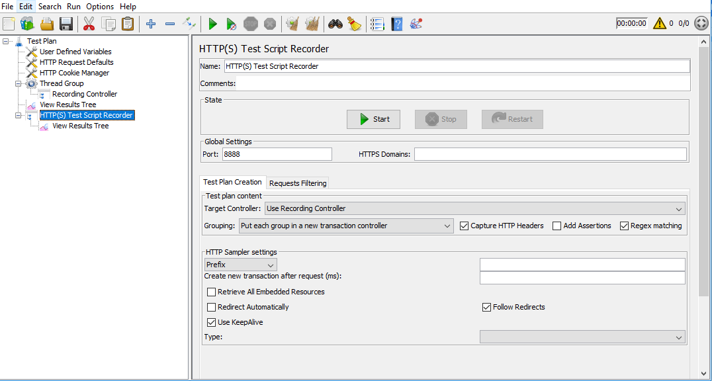
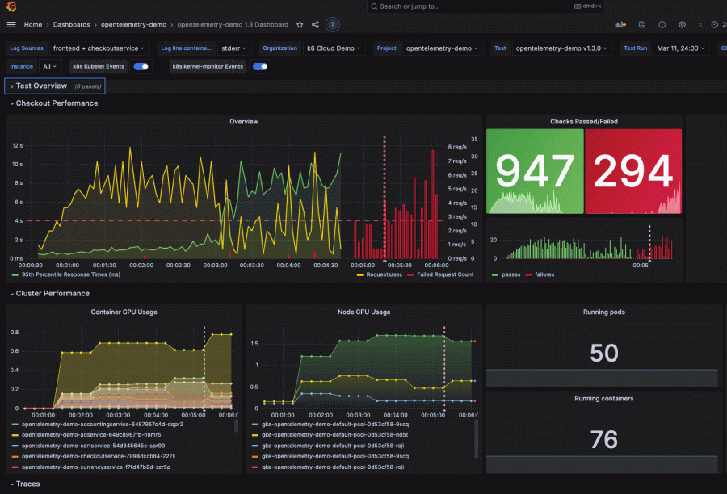

## Load testing

---

**Load testing** is the process of putting simulated demand on software, an application or website 
in a way that tests or demonstrates it's behavior under various conditions.

---
### Apache JMeter (https://jmeter.apache.org/)

---

### Grafana test dashboard (https://grafana.com/load-testing/)

